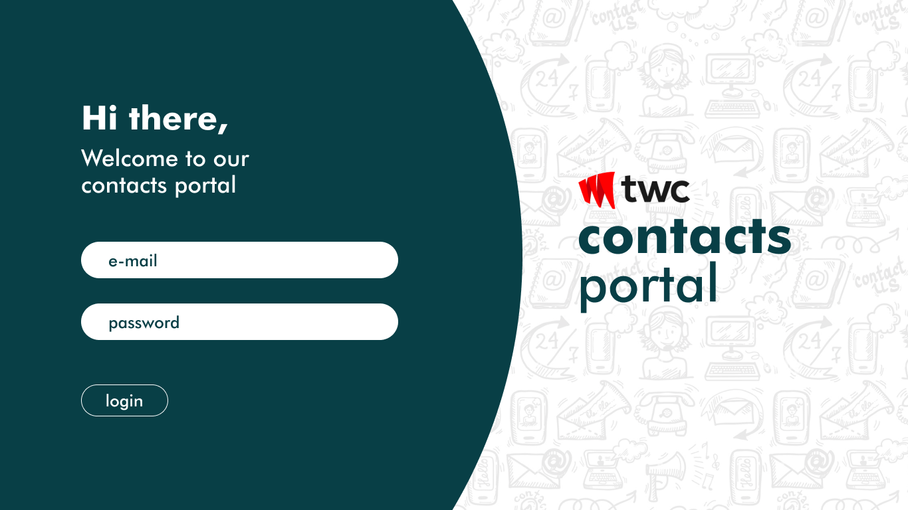

## TWC Intern Assignment

Hello, 
As discussed on our video chat, your next step will be to complete a task to test your knowledge of design, analytics, React and basics of a Rest api.
Your task will be to build a very basic full stack system. The initial screen will be a login page. Once the user signs in, they will be greeted with a welcome message and a button to add a “contact”. Once this button is clicked a form has to be filled to add a “contact”. A list of all “contacts” must be shown in a table along with the ability to edit and delete them. 

---

## Your challenge - TWC CONTACTS PORTAL APP

Your challenge is to build out these UIs and get it looking as close to the design as possible.

- React.js must be used to build the UI components.
  
  - You need to use **NextJs** or **Vite** for creating a React App
  
  - For styling React Components use **Tailwindcss**
  
  - Don't use any component libraries like  MUI or Daisy UI or Bootstrap
  
  - This challenge focuses on desktop design, you don't have to do mobile version but it would be nice if you think about different size of desktop monitors.
    
    - hint: refer xl and 2xl screen sizes on Tailwindcss

- A REST API must be built using Node.js to carry out the business logic.
  
  - You need to use express.js or Nest.js for creating an api

- You are free to use either a relational(mysql/postgres) or non relational database(mongodb).    

- You will be given 10 days to complete this task and you must strictly adhere to the UI design provided in the link below.

## React app pages and their routes

/             - welcome page

/login     - Login page

contacts/new - add new contact page

/contacts  - show all contacts page

---

## Submitting your project

- Create a public github repo with the name `twc-test-web` for the React App and  `twc-test-api` for the Node API and push your code.

share your public github repositories before the end of the deadline

 <b> <h1> Have fun building! 🚀 </h1> </b> 

